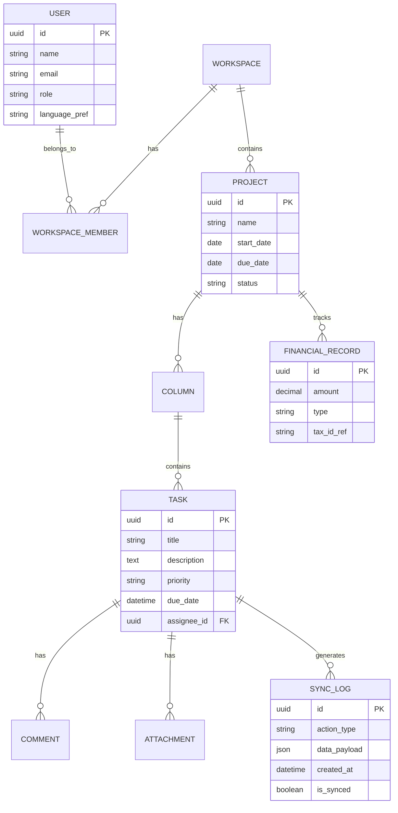
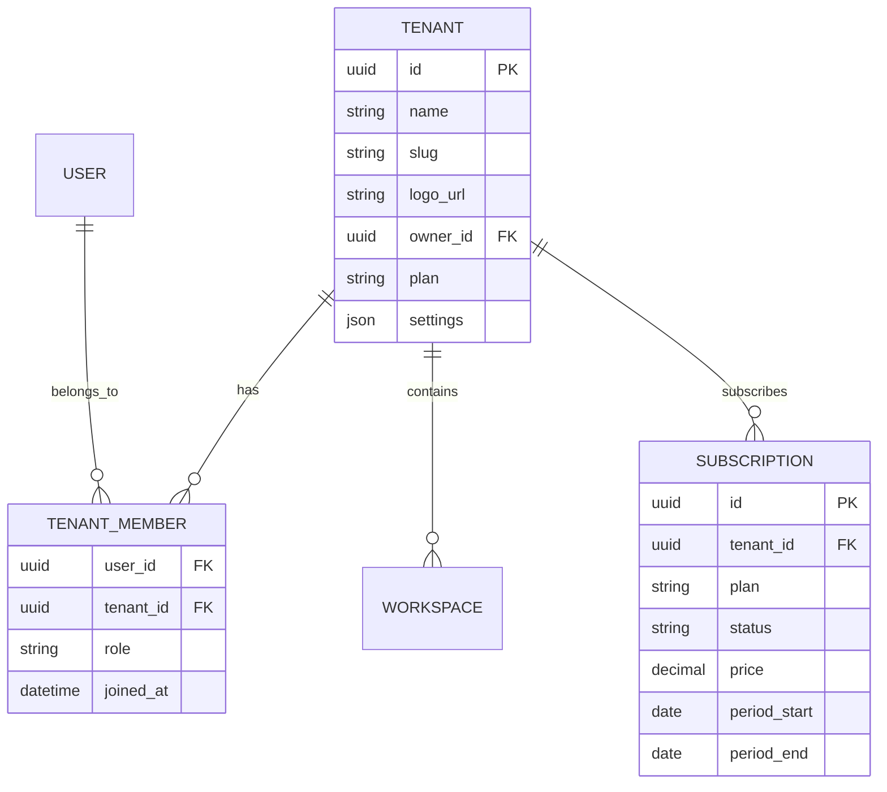

Berikut adalah dokumen lengkap dalam format Markdown (`.md`) yang menggabungkan seluruh komponen perencanaan aplikasi manajemen proyek untuk UMKM Indonesia, mulai dari PRD hingga spesifikasi teknis terbaru.

---

# Dokumentasi Perencanaan Produk: Sistem Manajemen Proyek UMKM Indonesia

## 1. Product Requirements Document (PRD)

### **A. Visi Produk**
[cite_start]Membangun solusi produktivitas serbaguna yang menggabungkan kesederhanaan antarmuka (UX) dengan fitur analitik manajerial dan keuangan yang selama ini absen pada kompetitor global[cite: 178, 205]. [cite_start]Fokus utama adalah lokalisasi untuk pasar Indonesia guna mempermudah digitalisasi UMKM[cite: 154, 176].

### **B. Target Pengguna (User Personas)**
* [cite_start]**Pemilik UMKM:** Membutuhkan pemantauan KPI dan biaya proyek secara sederhana[cite: 156, 159].
* [cite_start]**Manajer Proyek/Tim Operasional:** Membutuhkan koordinasi tugas harian yang efisien[cite: 156].
* [cite_start]**Tim Lapangan:** Membutuhkan akses mobile yang stabil di area minim sinyal (Offline Mode)[cite: 154, 179].

### **C. [cite_start]Prioritas Fitur (Roadmap)** [cite: 185-204]

* [cite_start]**Fase 1: MVP (Q3 2026)** [cite: 185]
    * [cite_start]Manajemen tugas dengan papan Kanban dan daftar tugas[cite: 186].
    * [cite_start]Kolaborasi dasar: Komentar, lampiran file, dan notifikasi real-time[cite: 188].
    * [cite_start]Akses multi-platform (Web & Mobile)[cite: 189].
* [cite_start]**Fase 2: Pertumbuhan (6-12 Bulan)** [cite: 191]
    * [cite_start]Tampilan Kalender dan Timeline (Gantt Chart)[cite: 192].
    * [cite_start]Otomatisasi alur kerja sederhana (Rules)[cite: 196].
    * [cite_start]Integrasi aplikasi (Slack, Google Workspace, WhatsApp)[cite: 194].
* [cite_start]**Fase 3: Jangka Panjang & Diferensiasi** [cite: 199]
    * [cite_start]Analitik keuangan: Forecasting biaya dan integrasi e-invoicing lokal[cite: 170].
    * [cite_start]AI-Assistant untuk drafting tugas dan estimasi durasi[cite: 201].
    * [cite_start]Fitur Offline Mode penuh dengan sinkronisasi otomatis[cite: 170].

### **D. [cite_start]Strategi Harga** [cite: 173]
* [cite_start]**Freemium:** Gratis untuk maksimal 3-5 pengguna dengan fitur dasar[cite: 173].
* [cite_start]**Premium:** Model *per-seat* per bulan dengan fitur otomatisasi dan laporan[cite: 173, 174].
* [cite_start]**Diskon Lokal:** Penyesuaian harga khusus pasar Indonesia (IDR) dan paket volume[cite: 175].

---

## 2. Entity Relationship Diagram (ERD)

Struktur database dirancang untuk mendukung fleksibilitas data (Custom Fields) dan sinkronisasi offline.



---

## 3. System Architecture (Scalable SaaS with Offline Sync)

Menggunakan pendekatan **Modular Monolith** atau **Microservices** untuk skalabilitas tinggi.

* **Frontend Layer:** Aplikasi Web (Vue JS) dan Mobile (Flutter/Native) berkomunikasi via API Gateway.
* **Application Layer (NestJS):**
    * **Project Service:** Menangani logika bisnis inti (Kanban, Tasks).
    * **Sync Service:** Mengelola antrean data dari perangkat offline menggunakan *Idempotent API*.
    * **Finance Service:** Menghitung analitik biaya dan integrasi pajak lokal.
* **Data & Cache Layer:**
    * **PostgreSQL:** Penyimpanan data relasional utama.
    * **Redis:** Digunakan untuk *session management*, *caching* dashboard, dan *pub/sub* notifikasi real-time.
* **Offline Sync Logic:**
    * Data disimpan di **IndexedDB** (browser) saat offline.
    * Perubahan dicatat dalam tabel `SYNC_LOG` di sisi klien.
    * Saat internet tersedia, klien mengirimkan `diff` data ke backend untuk digabungkan (Conflict Resolution).

---

## 4. Tech Stack

Pemilihan teknologi difokuskan pada stabilitas performa dan kecepatan pengembangan.

### **Frontend**
* **Framework:** **Vue JS 3** (Composition API).
* **Build Tool:** **Vite** (untuk *hot-reload* cepat dan *bundle* ringan).
* **State Management:** **Pinia** (pengganti Vuex yang lebih ringan).
* **UI Library:** **Tailwind CSS** + **Headless UI** (untuk tampilan bersih dan responsif).

### **Backend**
* **Framework:** **NestJS** (TypeScript).
* **ORM:** **Prisma** atau **TypeORM** (untuk interaksi database PostgreSQL yang aman).
* **Communication:** **Socket.io** (untuk sinkronisasi real-time antar pengguna).
* **Validation:** **Zod** atau **Class-validator**.

### **Infrastructure & Database**
* **Primary DB:** **PostgreSQL** (mendukung data relasional dan JSONB untuk fitur kustom).
* **Cache & Message Broker:** **Redis**.
* **Deployment:** **Docker** + **Kubernetes** (untuk skalabilitas otomatis).
* **Cloud:** AWS Jakarta Region atau Google Cloud Jakarta (untuk latensi rendah di Indonesia).

---

## 5. Authentication & Authorization

### **A. Metode Authentication**
| Metode | Deskripsi | Penggunaan |
| :--- | :--- | :--- |
| **Email/Password** | Login tradisional dengan hash bcrypt | Utama |
| **OAuth 2.0** | Google, Microsoft | Opsi alternatif |
| **JWT** | Access token (15 min) + Refresh token (7 hari) | Session management |
| **OTP (WhatsApp)** | Verifikasi nomor HP untuk Indonesia | Recovery & 2FA |

### **B. Role-Based Access Control (RBAC)**
```
ROLE_ADMIN (Workspace Owner)
├── Manage workspace settings
├── Delete workspace
├── Manage billing
└── Invite/remove members

ROLE_MANAGER
├── Create/edit/delete projects
├── Assign tasks
├── View all financial records
└── Manage team members

ROLE_MEMBER
├── Create/edit own tasks
├── View assigned tasks
└── Comment & attach files

ROLE_VIEWER (Future)
├── Read-only access to projects
└── View reports only
```

### **C. Invite System**
- **Email invite:** Kirim link undangan via email
- **WhatsApp invite:** Kirim link langsung via WhatsApp API (integrasi Fase 2)
- **Share link:** Generate workspace invite link dengan expiration

---

## 6. API Specification

### **A. API Design Principles**
- **Base URL:** `https://api.manapro.id/v1`
- **Protocol:** REST over HTTPS
- **Authentication:** Bearer JWT Token
- **Rate Limiting:** 100 requests/minute (authenticated), 20 requests/minute (unauthenticated)
- **Versioning:** URL-based (`/v1/`, `/v2/`)

### **B. Core Endpoints (Fase 1 MVP)**

#### Auth
| Method | Endpoint | Deskripsi |
| :--- | :--- | :--- |
| POST | `/auth/register` | Register new user |
| POST | `/auth/login` | Login dengan email/password |
| POST | `/auth/refresh` | Refresh access token |
| POST | `/auth/forgot-password` | Request password reset |
| POST | `/auth/reset-password` | Reset password dengan token |
| POST | `/auth/verify-email` | Verifikasi email |

#### Workspace
| Method | Endpoint | Deskripsi |
| :--- | :--- | :--- |
| GET | `/workspaces` | List user's workspaces |
| POST | `/workspaces` | Create new workspace |
| GET | `/workspaces/:id` | Get workspace details |
| PATCH | `/workspaces/:id` | Update workspace |
| DELETE | `/workspaces/:id` | Delete workspace |
| POST | `/workspaces/:id/invite` | Invite member to workspace |

#### Projects
| Method | Endpoint | Deskripsi |
| :--- | :--- | :--- |
| GET | `/workspaces/:wid/projects` | List projects in workspace |
| POST | `/workspaces/:wid/projects` | Create new project |
| GET | `/projects/:id` | Get project details |
| PATCH | `/projects/:id` | Update project |
| DELETE | `/projects/:id` | Delete project |

#### Columns (Kanban)
| Method | Endpoint | Deskripsi |
| :--- | :--- | :--- |
| GET | `/projects/:id/columns` | List columns |
| POST | `/projects/:id/columns` | Create column |
| PATCH | `/columns/:id` | Update column |
| DELETE | `/columns/:id` | Delete column |
| PATCH | `/columns/reorder` | Reorder columns |

#### Tasks
| Method | Endpoint | Deskripsi |
| :--- | :--- | :--- |
| GET | `/columns/:id/tasks` | List tasks in column |
| POST | `/columns/:id/tasks` | Create task |
| GET | `/tasks/:id` | Get task details |
| PATCH | `/tasks/:id` | Update task |
| DELETE | `/tasks/:id` | Delete task |
| PATCH | `/tasks/:id/move` | Move task to different column |
| POST | `/tasks/:id/comments` | Add comment |
| POST | `/tasks/:id/attachments` | Upload attachment |

#### Financial Records
| Method | Endpoint | Deskripsi |
| :--- | :--- | :--- |
| GET | `/projects/:id/financials` | List financial records |
| POST | `/projects/:id/financials` | Create financial record |
| PATCH | `/financials/:id` | Update record |
| DELETE | `/financials/:id` | Delete record |

#### Users
| Method | Endpoint | Deskripsi |
| :--- | :--- | :--- |
| GET | `/users/me` | Get current user profile |
| PATCH | `/users/me` | Update profile |
| POST | `/users/me/avatar` | Upload avatar |

### **C. Response Format**
```json
// Success
{
  "success": true,
  "data": { ... },
  "meta": {
    "page": 1,
    "limit": 20,
    "total": 100
  }
}

// Error
{
  "success": false,
  "error": {
    "code": "VALIDATION_ERROR",
    "message": "Invalid email format",
    "details": [...]
  }
}
```

### **D. WebSocket Events (Real-time)**
| Event | Deskripsi |
| :--- | :--- |
| `task:created` | Task baru dibuat |
| `task:updated` | Task diupdate |
| `task:moved` | Task dipindahkan antar column |
| `task:deleted` | Task dihapus |
| `comment:created` | Komentar baru |
| `member:joined` | Member baru bergabung |
| `notification:new` | Notifikasi baru |

---

## 7. Offline Sync Architecture

### **A. Local Storage Schema (IndexedDB)**
```typescript
// Database: manapro_offline

// stores:
- users: { id, name, email, avatar_url }
- workspaces: { id, name, ... }
- projects: { id, workspace_id, name, ... }
- columns: { id, project_id, name, position }
- tasks: { id, column_id, title, description, ... }
- comments: { id, task_id, content, ... }
- sync_queue: { id, table_name, record_id, action, payload, timestamp, status }
```

### **B. Sync Strategy**
1. **Initial Sync:** Saat login, download semua data workspace ke IndexedDB
2. **Offline Changes:** Semua perubahan disimpan ke `sync_queue` dengan status `pending`
3. **Conflict Detection:**
   - Setiap record memiliki `version` dan `updated_at` timestamp
   - Jika server version > client version saat sync, terjadi conflict
4. **Conflict Resolution:**
   - **Last-Write-Wins (default):** Timestamp terbaru yang menang
   - **Manual:** User memilih versi mana yang kept untuk conflict penting
   - **Field-level merge:** Untuk field yang tidak konflik

### **C. Sync Flow**
```
[Client Offline]
     ↓ (user action)
[Save to IndexedDB] → [Add to sync_queue]
     ↓ (internet available)
[Send to /sync API] → [Process on server]
     ↓ (success)
[Mark sync_queue as synced]
     ↓ (conflict detected)
[Resolve conflict] → [Update local & server]
```

### **D. API Endpoint**
| Method | Endpoint | Deskripsi |
| :--- | :--- | :--- |
| POST | `/sync/push` | Kirim perubahan dari client |
| GET | `/sync/pull` | Ambil perubahan sejak last_sync |
| POST | `/sync/resolve` | Resolve conflict |

---

## 8. UI/UX Specifications

### **A. Design System**
#### Color Palette
| Name | Hex | Usage |
| :--- | :--- | :--- |
| Primary | `#2563EB` (Blue 600) | Buttons, links, accents |
| Primary Dark | `#1D4ED8` (Blue 700) | Hover states |
| Secondary | `#64748B` (Slate 500) | Secondary text |
| Success | `#10B981` (Emerald 500) | Completed, positive |
| Warning | `#F59E0B` (Amber 500) | In progress, caution |
| Danger | `#EF4444` (Red 500) | Delete, error |
| Background | `#F8FAFC` (Slate 50) | Main background |
| Surface | `#FFFFFF` | Cards, modals |
| Border | `#E2E8F0` (Slate 200) | Dividers, borders |
| Text Primary | `#0F172A` (Slate 900) | Headings |
| Text Secondary | `#475569` (Slate 600) | Body text |

#### Typography
| Element | Font | Size | Weight |
| :--- | :--- | :--- | :--- |
| H1 | Inter | 32px | 700 |
| H2 | Inter | 24px | 600 |
| H3 | Inter | 20px | 600 |
| Body | Inter | 16px | 400 |
| Small | Inter | 14px | 400 |
| Caption | Inter | 12px | 400 |

#### Spacing System
- Base unit: 4px
- Scale: 4, 8, 12, 16, 24, 32, 48, 64, 96

#### Border Radius
- Small: 4px (buttons, inputs)
- Medium: 8px (cards, modals)
- Large: 12px (panels)
- Full: 9999px (avatars, badges)

### **B. Component Library**
- **Buttons:** Primary, Secondary, Ghost, Danger, Icon
- **Inputs:** Text, Textarea, Select, Checkbox, Radio, Date picker
- **Cards:** Base card, Card with header, Card with actions
- **Modals:** Base modal, Confirmation modal, Form modal
- **Navigation:** Sidebar, Topbar, Breadcrumbs
- **Feedback:** Toast notifications, Alerts, Loading spinners
- **Data Display:** Tables, Lists, Badges, Avatars

### **C. Responsive Breakpoints**
| Breakpoint | Width | Target |
| :--- | :--- | :--- |
| Mobile | < 640px | Phone portrait |
| Tablet | 640px - 1024px | Tablet, Phone landscape |
| Desktop | > 1024px | Desktop |

### **D. Key Screens (Fase 1 MVP)**
1. **Login/Register** - Email/password form, OAuth buttons
2. **Workspace List** - Cards view of workspaces
3. **Project Board (Kanban)** - Horizontal scrollable columns with cards
4. **Project List** - Table/card view of projects
5. **Task Detail** - Side panel or modal with all task info
6. **Create/Edit Task** - Form modal
7. **Settings** - Workspace settings, profile settings
8. **Onboarding** - Quick tour for new users

---

## 9. Security & Compliance

### **A. Data Security**
| Aspek | Implementasi |
| :--- | :--- |
| **Encryption at Rest** | PostgreSQL dengan pgcrypto |
| **Encryption in Transit** | TLS 1.3 |
| **Password Hashing** | bcrypt dengan salt 12 rounds |
| **API Security** | Helmet.js, CORS strict |
| **Input Validation** | Zod schema validation |
| **SQL Injection** | Parameterized queries (Prisma) |
| **XSS Protection** | Content Security Policy (CSP) |
| **CSRF** | CSRF tokens untuk state-changing operations |

### **B. Rate Limiting**
- **Auth endpoints:** 5 requests/minute
- **API endpoints:** 100 requests/minute
- **Upload:** 10 requests/minute

### **C. Data Compliance**
- **GDPR-compliant:** Data export, deletion rights
- **PDP (UU Indonesia):** Consent management, data retention policy
- **Data Retention:** 7 tahun untuk financial records

### **D. Audit Logging**
- Semua action sensitive (delete, permission change) dicatat
- Log disimpan di tabel `audit_logs` dengan user, action, timestamp, IP

---

## 10. DevOps & Infrastructure

### **A. Docker Configuration**
```yaml
# docker-compose.yml (Development)
services:
  api:
    build: ./backend
    ports:
      - "3000:3000"
    environment:
      - DATABASE_URL=postgresql://postgres:password@db:5432/manapro
      - REDIS_URL=redis://redis:6379
    depends_on:
      - db
      - redis

  web:
    build: ./frontend
    ports:
      - "5173:5173"
    depends_on:
      - api

  db:
    image: postgres:15-alpine
    volumes:
      - postgres_data:/var/lib/postgresql/data

  redis:
    image: redis:7-alpine
```

### **B. Environment Variables**
```
# Backend (.env)
NODE_ENV=development
PORT=3000
DATABASE_URL=postgresql://...
REDIS_URL=redis://...
JWT_SECRET=...
JWT_REFRESH_SECRET=...

# Frontend (.env)
VITE_API_URL=http://localhost:3000
VITE_WS_URL=ws://localhost:3000
```

### **C. CI/CD Pipeline (GitHub Actions)**
```yaml
# .github/workflows/ci.yml
on: [push, pull_request]

jobs:
  test:
    runs-on: ubuntu-latest
    steps:
      - uses: actions/checkout@v4
      - run: npm ci
      - run: npm run lint
      - run: npm run test

  build:
    needs: test
    runs-on: ubuntu-latest
    steps:
      - run: npm run build
      - run: docker build -t manapro:${{ github.sha }}
```

### **D. Deployment (Production)**
- **Container Registry:** AWS ECR / Google Container Registry
- **Orchestration:** AWS ECS / Google Cloud Run
- **CDN:** CloudFront / Cloud CDN
- **Monitoring:** Sentry (error tracking), DataDog (metrics)
- **Logging:** ELK Stack / CloudWatch

---

## 11. Testing Strategy

### **A. Testing Pyramid**
```
        /\
       /E2E\        ← 10% - Critical user flows
      /----\
     /Int\          ← 20% - Service integration
    /------\
   / Unit \         ← 70% - Business logic
  /--------\
```

### **B. Testing Tools**
| Level | Tools | Coverage Target |
| :--- | :--- | :--- |
| Unit | Vitest, Jest | 80% |
| Integration | Supertest | 70% |
| E2E | Playwright | Critical paths |

### **C. Test Coverage Requirements**
- **Unit tests:** All services, utilities, validators
- **Integration tests:** All API endpoints
- **E2E tests:** Login, Create project, Kanban operations

### **D. Critical User Flows to Test**
1. User registration & login
2. Create workspace & invite member
3. Create project & columns
4. Create, edit, move, delete tasks
5. Offline sync flow
6. Real-time collaboration

---

## 12. Localization (i18n)

### **A. Supported Languages**
| Code | Language | Status |
| :--- | :--- | :--- |
| id | Bahasa Indonesia | Primary |
| en | English | Secondary |

### **B. i18n Implementation**
- **Library:** vue-i18n (Frontend), nestjs-i18n (Backend)
- **Structure:**
```
/locales
  /id
    common.json
    auth.json
    project.json
    task.json
  /en
    common.json
    auth.json
    project.json
    task.json
```

### **C. Translation Keys Structure**
```json
{
  "common": {
    "save": "Simpan",
    "cancel": "Batal",
    "delete": "Hapus",
    "edit": "Edit"
  },
  "auth": {
    "login": "Masuk",
    "register": "Daftar",
    "forgot_password": "Lupa kata sandi"
  },
  "project": {
    "create": "Buat Proyek",
    "name": "Nama Proyek",
    "status": "Status"
  },
  "task": {
    "create": "Buat Tugas",
    "title": "Judul",
    "description": "Deskripsi",
    "due_date": "Tenggat"
  }
}
```

### **D. Currency & Date Format**
- **Currency:** IDR (Rp), format: `1.234.567`
- **Date:** DD/MM/YYYY (Indonesia), MM/DD/YYYY (US)
- **Time:** 24-hour format

---

## 13. Konteks Pengembangan (Positif vs Negatif)

| Aspek | Konteks Positif (Peluang) | Konteks Negatif (Risiko/Kekurangan Kompetitor) |
| :--- | :--- | :--- |
| **UX & Performa** | Kecepatan akses tinggi karena server lokal dan stack ringan (Vite + NestJS). | [cite_start]Menghindari kelambatan UI yang dialami ClickUp dan Monday akibat beban sistem berlebih[cite: 143, 145]. |
| **Fitur** | [cite_start]Adanya fitur pelacakan biaya dan pajak lokal yang sangat dibutuhkan UMKM[cite: 170, 178]. | [cite_start]Menutup celah Trello yang tidak memiliki manajemen keuangan dan analitik[cite: 129, 130]. |
| **Adaptasi** | [cite_start]Dukungan bahasa dan bantuan lokal meningkatkan kepercayaan UMKM Indonesia[cite: 154]. | [cite_start]Kurva belajar Jira yang terlalu curam untuk tim non-teknis[cite: 140]. |
| **Konektivitas** | [cite_start]*Offline Mode* menjamin operasional tim di daerah minim infrastruktur internet[cite: 170]. | Ketergantungan penuh kompetitor global pada koneksi *cloud* yang stabil. |

---
## 14. Multi-Tenancy Architecture

### **A. Tenant Isolation Strategy**

#### Row-Level Security (RLS) - PostgreSQL
```sql
-- Setiap tabel memiliki tenant_id sebagai filter otomatis
ALTER TABLE workspaces ADD COLUMN tenant_id UUID NOT NULL;
ALTER TABLE projects ADD COLUMN tenant_id UUID NOT NULL;
ALTER TABLE tasks ADD COLUMN tenant_id UUID NOT NULL;

-- RLS Policy: Query otomatis difilter berdasarkan tenant
ALTER TABLE workspaces ENABLE ROW LEVEL SECURITY;

CREATE POLICY tenant_isolation ON workspaces
  USING (tenant_id = current_setting('app.current_tenant')::UUID);
```

#### Tenant Identification
| Method | Usage |
| :--- | :--- |
| **Subdomain** | `nama-umkm.manapro.id` (Production) |
| **URL Path** | `/w/:tenantId/...` (Development/Fallback) |
| **JWT Claim** | `tenant_id` di dalam token untuk API validation |
| **Header** | `X-Tenant-ID` untuk API Gateway routing |

### **B. Tenant Data Model**


### **C. Tenant Settings (Per-Tenant Configuration)**
```json
{
  "max_members": 3,
  "max_projects": 2,
  "custom_branding": false,
  "audit_log": false,
  "storage_limit_mb": 100,
  "features": ["kanban", "comments"]
}
```

---

## 15. Tier Pricing & Subscription

### **A. Pricing Plans**

| Fitur | Free | Pro | Enterprise |
| :--- | :---: | :---: | :---: |
| **Harga/Bulan** | Rp 0 | Rp 49.000/user | Custom |
| **Anggota Tim** | 3 | 20 | Unlimited |
| **Proyek** | 2 | 20 | Unlimited |
| **Storage** | 100 MB | 5 GB | 50 GB |
| **Kanban Board** | ✅ | ✅ | ✅ |
| **Komentar & Lampiran** | ✅ | ✅ | ✅ |
| **Notifikasi Real-time** | ✅ | ✅ | ✅ |
| **Kalender & Gantt** | ❌ | ✅ | ✅ |
| **Otomatisasi Workflow** | ❌ | ✅ | ✅ |
| **Custom Branding** | ❌ | ❌ | ✅ |
| **Audit Log** | ❌ | ❌ | ✅ |
| **Priority Support** | ❌ | ✅ | ✅ |
| **Offline Mode** | Basic | Full | Full |
| **Financial Tracking** | ❌ | ✅ | ✅ |
| **API Access** | ❌ | ❌ | ✅ |

### **B. Subscription States**
```
ACTIVE       → Akses penuh sesuai plan
PAST_DUE     → Grace period 7 hari, akses dibatasi
CANCELLED    → Read-only mode setelah grace period
TRIAL        → 14 hari trial Pro untuk akun baru
```

### **C. Billing Cycle**
- **Monthly:** Bayar per bulan
- **Yearly:** Diskon 20% (bayar 10 bulan dapat 12 bulan)

---

## 16. Billing & Payment Localization

### **A. Payment Gateway (Indonesia)**
| Gateway | Metode | Status |
| :--- | :--- | :--- |
| **Midtrans** | Transfer Bank, E-wallet, QRIS, VA | Primary |
| **Xendit** | Transfer Bank, E-wallet, QRIS | Backup |

### **B. Payment Methods**
- **Transfer Bank:** BCA, Mandiri, BNI, BRI, Permata
- **E-Wallet:** GoPay, OVO, DANA, ShopeePay
- **QRIS:** Universal QR Code
- **Virtual Account:** BCA VA, Mandiri VA
- **Kartu Kredit:** Visa, Mastercard (via Midtrans)

### **C. Invoice & Billing**
```
Invoice Features:
├── Auto-generate invoice per billing cycle
├── PDF download
├── Email notification sebelum jatuh tempo
├── Reminder otomatis (H-3, H-1, H+1, H+7)
└── Payment confirmation via webhook
```

### **D. Currency & Tax**
- **Currency:** IDR (Rupiah)
- **Tax:** PPN 11% (otomatis ditambahkan)
- **Format:** Rp 49.000/bulan
- **NPWP:** Field opsional untuk enterprise

---

## 17. Self-Service Onboarding

### **A. Registration Flow**
```
[Landing Page] → [Sign Up]
     ↓
[Form: Name, Email, Password]
     ↓
[Email Verification] → [Simulated for frontend]
     ↓
[Create Tenant]
  ├── Business Name
  ├── Slug (auto-generated: nama-umkm)
  └── Industry (optional)
     ↓
[Select Plan] (Free/Pro/Enterprise)
     ↓
[Create First Workspace]
     ↓
[Dashboard] ✅
```

### **B. Onboarding Steps (In-App)**
1. **Welcome Tour** - Quick guide 3 langkah
2. **Create Project** - Template atau kosong
3. **Invite Team** - Optional, bisa skip
4. **Setup Profile** - Avatar, preferensi

### **C. Email Templates**
- **Welcome** - Selamat datang + link verifikasi
- **Invite** - Undangan bergabung ke tenant
- **Invoice** - Tagihan bulanan
- **Reminder** - Pembayaran akan jatuh tempo
- **Upgrade** - Saran upgrade saat limit tercapai

---

## 18. Security & Data Isolation

### **A. Tenant Data Isolation**
| Layer | Implementation |
| :--- | :--- |
| **Database** | RLS policy berdasarkan tenant_id |
| **API** | Middleware validasi tenant_id di setiap request |
| **Frontend** | Tenant context guard di router |
| **Cache** | Redis key prefix: `tenant:{id}:*` |

### **B. Security Measures**
| Aspek | Implementation |
| :--- | :--- |
| **Authentication** | JWT (access 15min + refresh 7 hari) |
| **Authorization** | RBAC per tenant (owner/admin/member/viewer) |
| **Data Encryption** | AES-256 at rest, TLS 1.3 in transit |
| **API Security** | Rate limiting, CORS, Helmet.js |
| **Input Validation** | Zod schema validation |
| **SQL Injection** | Parameterized queries (Prisma) |
| **XSS** | Content Security Policy (CSP) |
| **Audit Log** | Log semua action sensitive (Enterprise) |

### **C. RBAC Permissions Matrix**
| Action | Owner | Admin | Member | Viewer |
| :--- | :---: | :---: | :---: | :---: |
| Manage tenant settings | ✅ | ❌ | ❌ | ❌ |
| Manage billing | ✅ | ❌ | ❌ | ❌ |
| Invite/remove members | ✅ | ✅ | ❌ | ❌ |
| Create/edit projects | ✅ | ✅ | ✅ | ❌ |
| Create/edit tasks | ✅ | ✅ | ✅ | ❌ |
| Comment on tasks | ✅ | ✅ | ✅ | ❌ |
| View projects/tasks | ✅ | ✅ | ✅ | ✅ |
| View financial data | ✅ | ✅ | ❌ | ❌ |
| Custom branding | ✅ | ❌ | ❌ | ❌ |

### **D. Monitoring (Enterprise)**
- **Noisy Neighbor Detection** - Monitor resource usage per tenant
- **Rate Limit per Tenant** - Prevent one tenant from affecting others
- **Alert System** - Notify when tenant exceeds limits
- **Dashboard** - Prometheus/Grafana untuk ops team

---

## 19. Development Plan
* Planning
* FrontEnd Development (Current)
  - Phase 1: Core App (Kanban, Tasks, Comments) ✅
  - Phase 2: Notifications & Activity Log ✅
  - Phase 3: Multi-Tenant Foundation ← **Current**
* Backend Development
* Integration
* Testing
* Production Deployment

---

**Kesimpulan:**
Integrasi antara **Vue JS** dan **NestJS** memberikan fondasi yang sangat kuat untuk aplikasi PM yang responsif. Dengan arsitektur **Multi-Tenant** menggunakan **Row-Level Security**, sistem **Tier Pricing** yang fleksibel untuk pasar UMKM, dan integrasi **Payment Gateway lokal** (Midtrans/Xendit), produk ini siap menjadi solusi manajemen proyek terdepan untuk UMKM Indonesia dengan keamanan data tingkat enterprise.